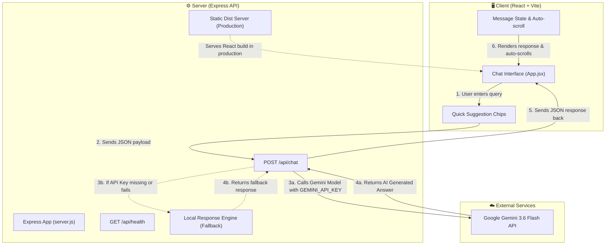

# AI Powered Chatbot

🚀 **Live Demo:** [https://ai-poweredchatagent.onrender.com/](https://ai-poweredchatagent.onrender.com/)

This project is a modern, full-stack AI-powered chatbot application powered by **Google Gemini 3.6 Flash**, built with **Node.js + Express** on the backend and **React + Vite** on the frontend.

---

## 🏗️ Architecture & Workflow Diagram

GitHub markdown naturally renders Mermaid diagrams! Here is how every component is connected and operates:



---

## 🔍 How Components Work Together

### 1. 🖥️ **Frontend (`/client`)**
- **Tech Stack:** React 18, Vite, Vanilla CSS
- **`App.jsx`**: Manages interactive chat UI, instant suggestion chips, message history, loading state, copy-to-clipboard, and smooth auto-scrolling.
- **Vite Proxy:** In development, requests to `/api/*` are automatically proxied to `http://localhost:5000`.

### 2. ⚙️ **Backend (`/server`)**
- **Tech Stack:** Node.js, Express, Cors, `@google/generative-ai`
- **`server.js`**: Handles `/api/chat` POST requests.
  - If `GEMINI_API_KEY` is present, it prompts `gemini-3.6-flash` with custom system instructions.
  - If the API key is absent or fails, it gracefully degrades to a **Local Rule-Based Fallback Engine** to ensure zero downtime.
  - In Production (e.g. Render), Express serves static build assets from `client/dist`.

### 3. ☁️ **Deployment (Render)**
- Configured for single-service full-stack deployment on **Render.com**.
- **Build Command:** `npm run build` *(Installs packages & builds Vite client)*
- **Start Command:** `npm start` *(Starts Express server)*

---

## 🛠️ Run Locally

1. **Clone the repo:**
   ```bash
   git clone https://github.com/ShubhamChaudhary0/AI_PoweredChatAgent.git
   cd AI_PoweredChatAgent
   ```

2. **Set up Environment Variables:**
   Create `.env` inside the `server/` folder:
   ```env
   GEMINI_API_KEY=your_gemini_api_key_here
   PORT=5000
   ```

3. **Start both Server & Client concurrently:**
   ```bash
   npm install
   npm run dev
   ```

4. Open `http://localhost:3000` in your browser!
